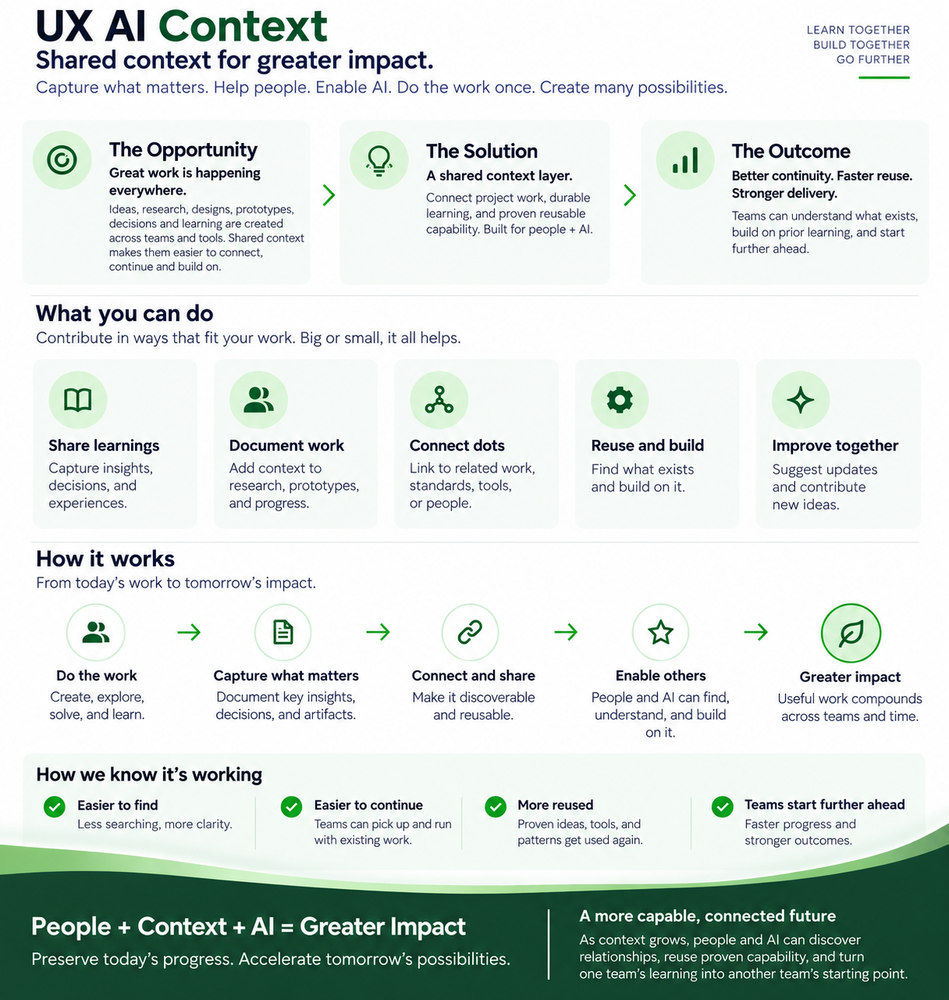

# UX AI Context

A shared, versioned **context and collaboration layer** for UX AI work.

It helps people and AI understand what matters, continue work without reconstructing history, and reuse the parts that deserve to compound.

> **Make useful project context easy to find, understand, contribute to, and reuse.**

<p align="center">
  
</p>

<p align="center">
  <a href="assets/uxai-context-overview.png">View the full-size overview</a>
</p>

---

## What this is

UX AI Context connects three lightweight layers:

| Layer | Purpose |
|---|---|
| [`projects/`](projects/) | Durable context around active project work |
| [`shared/`](shared/) | Reusable capability that has proven valuable beyond one project |
| [`community/`](community/) | Principles for how community activity can surface, incubate, and promote meaningful contributions |

Primary artifacts still live where they belong: Figma, code repositories, Jira, SharePoint, Teams, and other source systems.

UX AI Context preserves the **why, learning, decisions, relationships, and links** around that work.

> **Link to the artifact. Capture the context.**

---

## Current focus

We are deliberately proving the system through real work before adding more structure.

### 1. Establish the UX AI Context umbrella
Make onboarding, contribution, retrieval, and reuse simple enough that the system becomes useful without becoming process.

### 2. Kickstart Periscope
[Periscope](projects/periscope/) is the first working project using the pattern.

Start with:
- [Project overview](projects/periscope/README.md)
- [Current state](projects/periscope/now.md)
- [Active work](projects/periscope/work/)

### 3. Preserve the community model for later
The [community principles](community/) capture how Teams, Viva Engage, email, demos, and other engagement can eventually feed high-signal context without turning the repo into a dumping ground.

For now, they are guidance — not an operating bureaucracy.

---

## Start here

| I want to... | Go here |
|---|---|
| Join for the first time | [Getting Started](docs/GETTING-STARTED.md) |
| Contribute notes, research, decisions, or updates | [Working with Context](docs/WORKING-WITH-CONTEXT.md) |
| Work on Periscope | [Periscope](projects/periscope/) |
| Browse projects and current owners/status | [Project Index](docs/INDEX.md) |
| Use a template or see a completed example | [Templates](templates/README.md) |
| Start another project | [Add a Project](docs/ADD-A-PROJECT.md) |
| Share something that has proven reusable | [Shared](shared/README.md) |
| Understand the community contribution model | [Community](community/README.md) |
| Understand how this scales | [Scale the System](docs/SCALE.md) |
| Use Copilot or another agent | [Agent Guide](AGENTS.md) |

New to GitHub? Start with **Getting Started**. You can make useful contributions directly on GitHub.com without installing anything.

---

## The operating model

```text
Work happens where it belongs
Figma · Teams · Jira · SharePoint · code · research
                         │
                         ▼
                    uxai-context
          durable context + links + Git history
                         │
          ┌──────────────┼──────────────┐
          ▼              ▼              ▼
       People         AI/agents      Periscope
          │              │              │
          └──────────────┼──────────────┘
                         ▼
                  better next work
```

When meaningful work happens, ask:

> **Did we learn, decide, or change something another person should be able to find later?**

If yes, make the smallest useful update.

If part of the work proves useful beyond one project, promote **only the reusable part** into [`shared/`](shared/README.md).

---

## Principles

- **Keep context close to the work.**
- **Deep expertise. Broader contribution. Shared context.**
- **Reduce handoffs when context and capability allow the work to continue.**
- **Capture what will remain useful.**
- **Capture the reusable part, not everything.**
- **Link rather than duplicate.**
- **Share broadly. Promote selectively.**
- **Promote signal, not activity.**
- **Use AI to reduce coordination and documentation effort.**
- **Standardize entry points; let structure evolve through use.**

---

## Repository map

```text
uxai-context/
├── README.md
├── CONTRIBUTING.md
├── AGENTS.md
├── docs/          # onboarding, working model, replication, scale
├── projects/      # active project context
├── shared/        # proven reusable capability
├── community/     # engagement + contribution + governance principles
├── templates/     # lightweight starting points + examples
└── assets/        # communication assets
```

For the practical guides, see [docs/README.md](docs/README.md).
