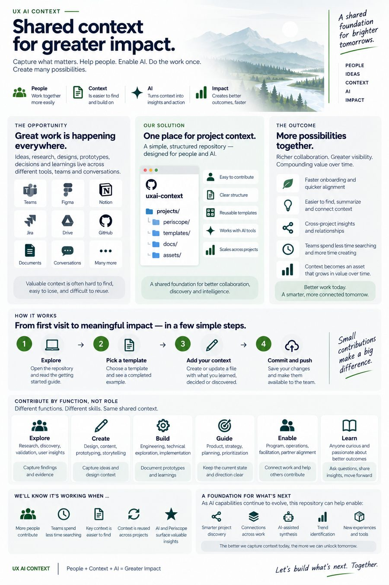

# UX AI Context

A shared, versioned context layer for UX AI work.

It helps teams keep the important parts of a project easy to find and reuse: current state, decisions, research, meeting outcomes, prototype learnings, source links, and the reasoning behind the work.

> **Make project context easy for people and AI to find, understand, and reuse.**

<p align="center">
  
</p>

<p align="center">
  <a href="assets/uxai-context-overview.jpg">View the full-size overview</a>
</p>

---

## Start here

Choose the path that matches what you need.

| I want to... | Start here |
|---|---|
| Join the repo for the first time | [Getting Started](docs/GETTING-STARTED.md) |
| Add notes, research, decisions, or updates | [Working with Context](docs/WORKING-WITH-CONTEXT.md) |
| See blank templates and completed examples | [Templates](templates/README.md) |
| Start a new project using the same setup | [Add a Project](docs/ADD-A-PROJECT.md) |
| Understand how this scales across teams | [Scale the System](docs/SCALE.md) |
| Use Copilot or another AI agent with the repo | [Agent Guide](AGENTS.md) |

If you are new to GitHub, start with **Getting Started**. You can contribute directly on GitHub.com without installing anything.

---

## How it works

```text
Daily work happens where it belongs
Figma · Jira · SharePoint · Teams · code repositories
                         │
                         ▼
                 uxai-context
          durable context + links + Git history
                         │
        ┌────────────────┼────────────────┐
        ▼                ▼                ▼
     People         Copilot/agents     Periscope
```

The repository does **not** try to replace the tools teams already use.

It connects them with durable context.

> **Link to the artifact. Capture the context.**

### Deep expertise. Broader contribution. Shared context.

UX AI Context is designed for teams where contribution increasingly crosses traditional role boundaries without erasing specialist depth.

A researcher may help shape an experience. A designer may prototype working behavior. A design engineer may influence interaction direction. Product, content, engineering, and AI-enabled contributors may all move work forward in different ways.

The point is **not** that everyone does everything. The point is that fewer handoffs are required when people have the context and capability to contribute meaningfully across the loop.

Shared context helps that broader contribution retain depth: evidence, rationale, design intent, decisions, implementation learning, and history remain connected.

---

## The project pattern

Every project starts with the same small contract:

```text
projects/<project>/
├── README.md       # what the project is
├── now.md          # what matters right now
├── project.yaml    # lightweight structured identity
├── decisions/
├── meetings/
├── research/
└── prototypes/
```

This gives people a predictable place to start and gives AI/downstream tools a consistent structure to understand.

Use the [Project Starter Kit](templates/project-starter/) when adding another project.

---

## Current project

### [Periscope](projects/periscope/)

Periscope is one of the first projects using this context pattern and can also consume the structured context as part of UX AI dogfooding.

Start with:

- [Project overview](projects/periscope/README.md)
- [Current state](projects/periscope/now.md)

Periscope is one consumer of the context layer, not the reason the repository exists.

---

## What belongs here

Capture durable context that will help someone understand or advance the work later.

Good examples:

- important decisions and why they were made
- research findings and implications
- meaningful changes in project direction
- prototype learnings
- important open questions
- useful meeting outcomes
- links to authoritative artifacts
- the current project snapshot

Usually skip:

- every chat message
- every small task
- routine status narration
- copies of content that already has a source of truth elsewhere

---

## Where does the source live?

| Type of work | Usually lives in |
|---|---|
| Design | Figma |
| Code | Product/code repository |
| Enterprise documents | SharePoint / OneDrive |
| Formal delivery tracking | Jira |
| Fast conversation | Teams |
| Durable project context | `uxai-context` |

The context repo should explain **why something matters, what changed, what we learned, and where to find the authoritative artifact**.

---

## Two contribution modes

### GitHub.com — easiest

Best for quick updates and people new to Git.

Open a file → **Edit** → make the change → **Commit changes**.

To add a new note:

1. open [Templates](templates/README.md)
2. copy the template you need
3. go to the relevant project folder
4. choose **Add file → Create new file**
5. paste, edit, and commit

See [Getting Started](docs/GETTING-STARTED.md).

### GitHub Desktop + VS Code + Copilot — best for regular contributors

Pull → open in VS Code → edit → review in GitHub Desktop → commit → push.

Copilot can help orient you, find related context, and turn rough notes into concise durable records.

---

## Designed to scale with AI

The structure is intentionally simple today but useful for increasingly capable AI systems and long-running agents.

Clear, linked, versioned files give agents durable state they can use to:

- orient to a project
- find related decisions and research
- prepare for meetings
- summarize what changed
- identify open questions
- suggest context updates
- connect work across artifacts
- continue longer-running tasks

We do **not** need to build a separate agent platform now.

The foundation is:

**clear files + consistent entry points + source links + Git history + human review.**

See [AGENTS.md](AGENTS.md).

---

## Initial use cases

1. **Shared project context** — understand what a project is and where it stands.
2. **Day-to-day collaboration** — retain useful context created while the team works.
3. **AI-assisted work** — give Copilot and future agents reliable project state.
4. **Onboarding** — help new contributors orient without reconstructing history.
5. **Reporting and synthesis** — derive updates from existing context.
6. **Context experiences** — support Periscope and other discovery/navigation experiences.
7. **Future discovery** — connect projects, people, research, decisions, prototypes, and learnings as the system grows.

---

## Repository map

```text
uxai-context/
├── README.md
├── CONTRIBUTING.md
├── AGENTS.md
│
├── docs/
│   ├── README.md
│   ├── GETTING-STARTED.md
│   ├── WORKING-WITH-CONTEXT.md
│   ├── ADD-A-PROJECT.md
│   └── SCALE.md
│
├── projects/
│   └── periscope/
│       ├── README.md
│       ├── now.md
│       ├── project.yaml
│       ├── decisions/
│       ├── meetings/
│       ├── research/
│       └── prototypes/
│
└── templates/
    ├── README.md
    ├── decision.md
    ├── meeting.md
    ├── research-note.md
    ├── work-thread.md
    ├── project-starter/
    └── examples/
```

---

## The operating rule

When meaningful work happens, ask:

> **Did we learn, decide, or change something another person should be able to find later?**

If yes, make the smallest useful context update.

That is the system.

---

## Principles

- **Keep context close to the work.**
- **Deep expertise. Broader contribution. Shared context.**
- **Reduce handoffs when context and capability allow the work to continue.**
- **Capture what will remain useful.**
- **Link rather than duplicate.**
- **Standardize the entry points, not every project's content.**
- **Prefer current context over exhaustive documentation.**
- **Use AI to reduce coordination and documentation effort.**
- **Write once and enable many uses.**
- **Let the system evolve through use.**
